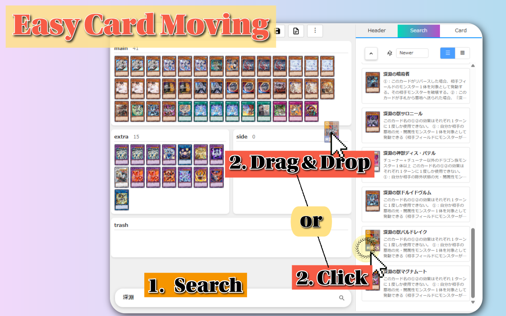
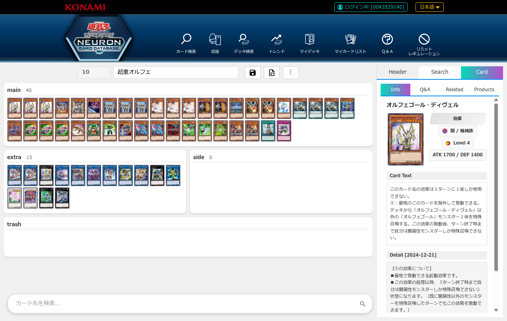
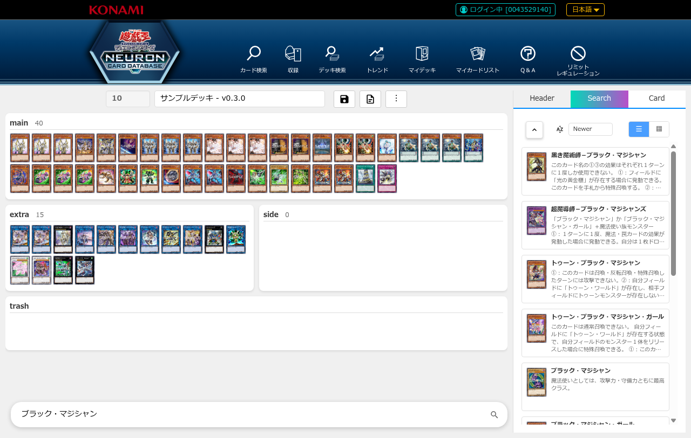
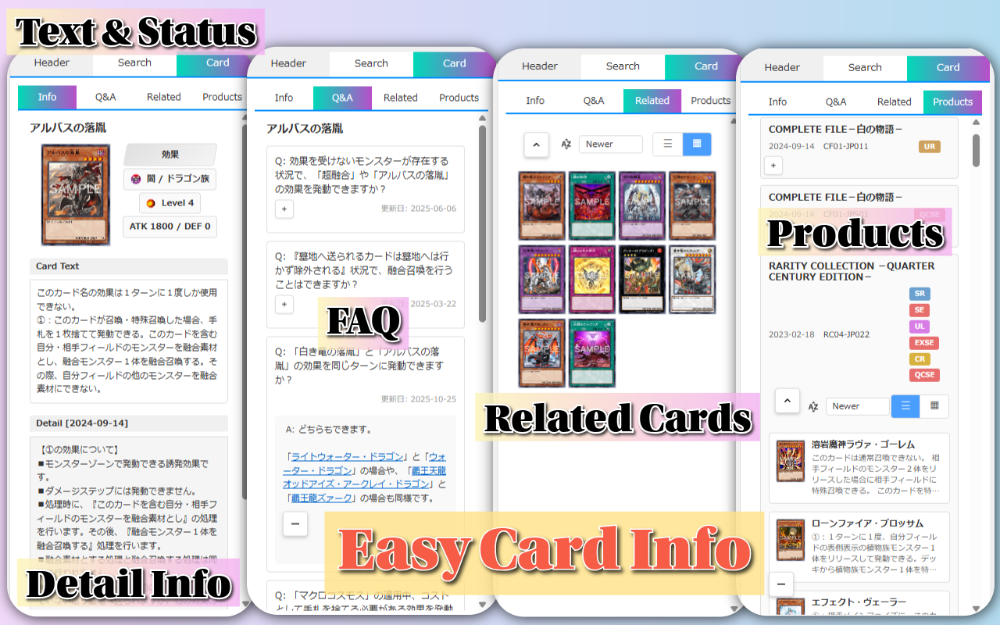
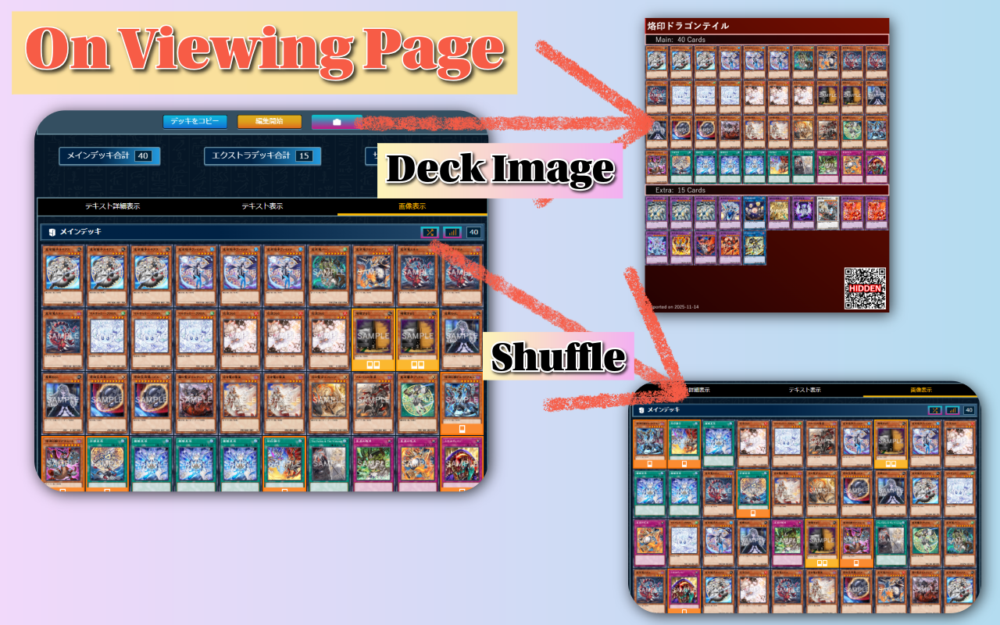
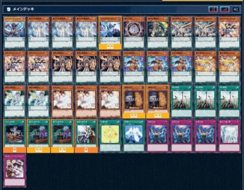

# 遊戯王NEXT

PCからも新鮮で快適な遊戯王Neuronライフを！

**遊戯王NEXT(Neuron EXTension)**は、~~Neo-Spacianではなく、~~遊戯王Neuron(公式カードデータベース)でのデッキ管理を支援するChrome拡張機能です。

**現在のバージョン**: v0.3.1 ([変更履歴](./docs/changelog/))

## intro

随分便利になった遊戯王Neuronアプリ。もう今では、PCから遊戯王公式データベースを見るけど、デッキ編集はスマホからしかしてない。そんな人も多いのではないでしょうか。

しかし、やっぱり。PCから操作したいときというものはあるものです。
そんなあなたを強力にこの拡張機能はサポートします。

PC版の遊戯王Neuron(公式データベース)でも、カード画像を並べながらデッキ編集できます！
カードをマウスでのドラッグ操作でも、クリック操作でも自在に移動できます！
カードを検索して、そこからカードを追加できます！
ページを移動せずにカードのテキスト、QAページでの解説、関連QA、関連カード、関連商品をすべてみることができます！

## 主要機能

### デッキ編集UI (v0.3)

デッキ詳細ページにインタラクティブな編集UIを追加します。

**機能詳細：**
- マウスでのドラッグ&ドロップでカードを移動
- カード検索エリアから追加
- ワンクリックでカード移動操作
- リスト/グリッド表示切り替え
- スムーズなアニメーション
- 多言語対応

カード詳細情報も充実：

詳細は [デッキ編集機能ガイド](./docs/usage/custom-deck-edit.md) をご覧ください。

### デッキ表示画面

公式デッキ表示ページに便利な機能を追加します：

#### カードのシャッフル

デッキのカード順序をランダムに並べ替えたり、元に戻したりできます。特定のカードを固定して、シャッフル時に先頭に配置し続けることも可能です。
デッキの回し具合を、簡単に確かめたいときのために。

**機能詳細：**
- カードをワンクリックでシャッフル
- ソートボタンで元の順序に戻す
- カード右上クリックで固定/固定解除
- 固定したカードはデッキ先頭に固定配置

#### デッキ画像作成

デッキレシピをスマホのNeuronアプリのように画像として保存できます。
意図的に一部のデザインを公式とは変えています。

**機能詳細：**
- タイトルのカスタマイズ(デフォルトはデッキ名)
- 背景色の選択（赤/青）
- QRコードの表示/非表示切り替え
- 出力日時を記載

**作成される画像のサンプル：**

## インストール方法

### Chrome Web Storeから（準備中）

現在、Chrome Web Storeでの公開準備中です。

### 手動インストール

releasesページから最新の`.zip`ファイルをダウンロードし、以下の手順でインストールしてください：
1. Chromeの拡張機能管理ページを開く（`chrome://extensions/`）
2. 右上の「デベロッパーモード」を有効に
3. 「パッケージ化されていない拡張機能を読み込む」をクリック
4. ダウンロードした`.zip`ファイルを解凍し、そのフォルダを選択

## 使い方

インストール後、[遊戯王カードデータベース](https://www.db.yugioh-card.com/)のデッキ表示ページにアクセスすると、以下のボタンが追加されます：

- **シャッフルボタン**: メインデッキの枚数表示の左側
- **ソートボタン**: シャッフルボタンの右側
- **デッキ画像作成ボタン**: メタデータ部分の下部

詳細は [ドキュメント](./docs/usage/README.md) をご覧ください。

## 対応ページ

- デッキ詳細ページ (`member_deck.action?ope=1`) - 全機能利用可能
- デッキ編集ページ (`deck_edit.action`) - デッキ編集UI, デッキ画像作成

## 対応言語

### 公式サイトの言語対応（カード情報パース）

拡張機能は公式サイトの以下10言語に対応しています：
- 日本語 (ja) / 英語 (en) / アジア英語 (ae)
- 韓国語 (ko) / 中国語 (cn)
- ドイツ語 (de) / フランス語 (fr) / イタリア語 (it) / スペイン語 (es) / ポルトガル語 (pt)

言語は公式サイトから自動検出されます（`request_locale`パラメータ）。

### 拡張機能UI

**注意**: 拡張機能のUI自体は多言語化されておらず、英語と日本語が混在しています。

## milestone

- [ ] 独自デッキ管理画面追加
- [ ] 簡易一人回し機能追加

## 注意事項

この拡張機能は非公式のツールです。遊戯王公式サイトの利用規約を遵守してご使用ください。

## ライセンス

ISC

## 開発者向け

- [アーキテクチャ設計](./docs/dev/architecture.md)
- [多言語対応 (i18n) ガイド](./docs/dev/i18n.md)
- [API ドキュメント](./docs/api/README.md)

## 関連リンク

- [遊戯王カードデータベース](https://www.db.yugioh-card.com/)
- [使い方ドキュメント](./docs/usage/README.md)
- [デッキ編集機能](./docs/usage/custom-deck-edit.md)
- [変更履歴 (CHANGELOG)](./docs/changelog/)

## お問い合わせ

ご質問・ご要望・バグ報告は、以下の方法でご連絡ください：

**お問い合わせフォーム**:
https://docs.google.com/forms/d/e/1FAIpQLSdh2wRCUWpX6ZLfma-g5O46eD93wOPHpDHWQGxdOcJLmm_tGQ/viewform?usp=pp_url&entry.1848091360=%E9%81%8A%E6%88%AF%E7%8E%8BNEXT(YuGiOh+Neuron+EXTension)

**メール**:
TomoIris427+GitHub@gmail.com

**GitHub Issues** (機能要望・バグ報告):
https://github.com/TomoTom0/YuGiOh-NEXT/issues
