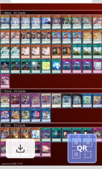
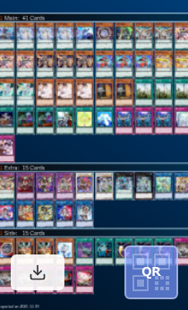
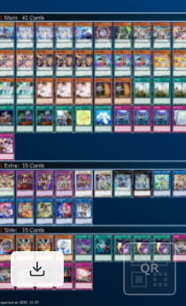

# Yu-Gi-Oh! Deck Helper

遊戯王公式カードデータベースでのデッキ管理を支援するChrome拡張機能です。カードのシャッフルや固定、デッキ画像の作成など、公式サイトにはない便利な機能を追加します。

## 主要機能

### カードのシャッフル・ソート・固定

デッキのカード順序をランダムに並べ替えたり、元に戻したりできます。特定のカードを固定して、シャッフル時に先頭に配置し続けることも可能です。


**機能詳細：**
- カードをワンクリックでシャッフル
- ソートボタンで元の順序に戻す
- カード右上クリックで固定/固定解除
- 固定したカードは常にデッキ先頭に配置
- メインデッキ、エクストラデッキ、サイドデッキすべてに対応

### デッキ画像の作成

デッキレシピを画像として保存できます。SNSでの共有やアーカイブに便利です。


**機能詳細：**
- デッキ名のカスタマイズ
- 背景色の選択（赤/青）
- QRコードの表示/非表示切り替え
- ワンクリックで画像をダウンロード

**作成される画像のサンプル：**

| 赤背景 + QR | 青背景 + QR | 青背景（QRなし） |
|------------|------------|----------------|
|  |  |  |

## インストール方法

### Chrome Web Storeから（準備中）

現在、Chrome Web Storeでの公開準備中です。

### 手動インストール

1. このリポジトリをクローンまたはダウンロード
2. `npm install` で依存関係をインストール
3. `npm run build` でビルド
4. Chromeで `chrome://extensions/` を開く
5. 「デベロッパーモード」を有効化
6. 「パッケージ化されていない拡張機能を読み込む」から `dist/` ディレクトリを選択

## 使い方

インストール後、[遊戯王カードデータベース](https://www.db.yugioh-card.com/)のデッキ表示ページにアクセスすると、以下のボタンが追加されます：

- **シャッフルボタン**: メインデッキの枚数表示の左側
- **ソートボタン**: シャッフルボタンの右側
- **デッキ画像作成ボタン**: ページ下部の右端

詳細な使い方は [ドキュメント](./docs/usage/index.md) をご覧ください。

## 対応ページ

- デッキ表示ページ (`member_deck.action?ope=1`)

## 開発

### 必要要件

- Node.js 18以上
- npm

### セットアップ

```bash
# 依存関係のインストール
npm install

# 開発モードでビルド（ウォッチモード）
npm run dev

# プロダクションビルド
npm run build

# テスト実行
npm test
```

### プロジェクト構造

```
ygo-deck-helper/
├── src/
│   ├── content/         # コンテンツスクリプト
│   │   ├── shuffle/     # シャッフル・ソート・固定機能
│   │   ├── deck-recipe/ # デッキ画像作成機能
│   │   └── parser/      # HTMLパーサー
│   ├── types/           # TypeScript型定義
│   └── utils/           # ユーティリティ関数
├── public/
│   └── manifest.json    # 拡張機能マニフェスト
├── dist/                # ビルド出力
├── docs/                # ドキュメント
└── tests/               # テストコード
```

## 注意事項

この拡張機能は非公式のツールです。遊戯王公式サイトの利用規約を遵守してご使用ください。

## ライセンス

ISC

## 関連リンク

- [遊戯王カードデータベース](https://www.db.yugioh-card.com/)
- [使い方ドキュメント](./docs/usage/index.md)
