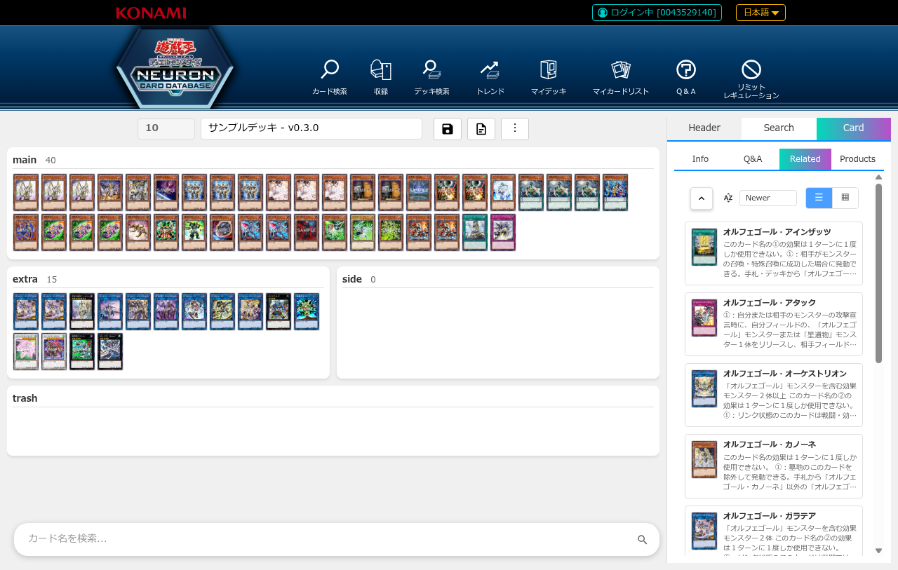
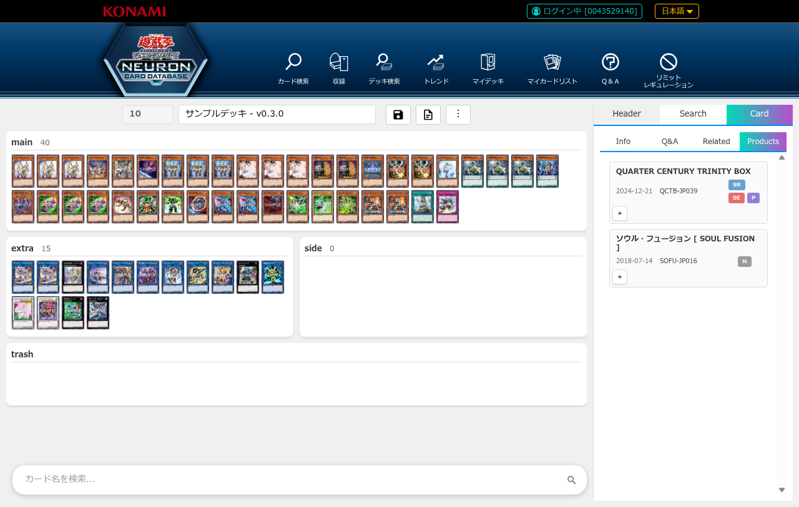
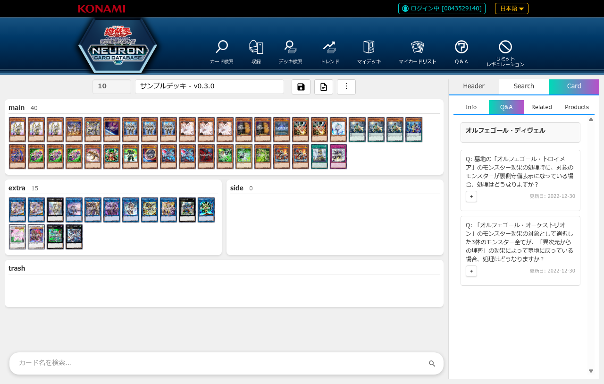
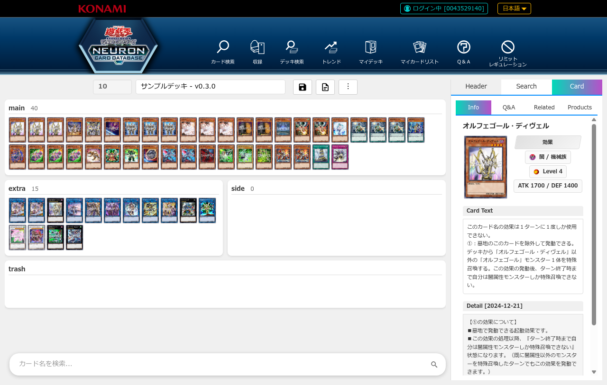

# デッキ編集機能

## 概要

遊戯王公式カードデータベースのデッキ詳細ページに、インタラクティブなデッキ編集UIを追加します。

**主な機能:**
- カード検索から簡単に追加
- ドラッグ&ドロップまたはクリック操作で移動
- ページを移動せずにカード詳細を確認

## UIの全体構成

デッキ編集画面は、左側にデッキエリア、右側にカード検索・詳細表示エリアの2カラム構成です。

**画面構成:**
- **左側**: デッキエリア（メインデッキ、エクストラデッキ、サイドデッキ）
- **右側**: 3つのタブでカード検索・詳細表示
  - **Header**: デッキ名入力、保存/削除ボタン
  - **Search**: カード検索機能
  - **Card**: カード詳細情報表示（Info/Related/Products/Q&A）

## 機能

### 1. ドラッグ&ドロップでカード移動

カードをドラッグして別のデッキエリアにドロップすることで、簡単にカードを移動できます。

**対応エリア:**
- メインデッキ
- エクストラデッキ
- サイドデッキ

**使い方:**
1. カードをクリック&ホールド
2. 移動先のエリアまでドラッグ
3. ドロップ

### 2. カード検索エリア

デッキに追加したいカードを検索できます。

**検索方法:**
- カード名で検索
- 属性・種族・レベルなどで絞り込み

**カードの追加:**
- 検索結果のカードをクリックして `M` ボタン（メイン/エクストラ）または `S` ボタン（サイド）でデッキに追加

**使い方:**
1. 右側の「Search」タブをクリック
2. 検索欄にカード名を入力（例: 「ブラック・マジシャン」）
3. 検索ボタンをクリック
4. 検索結果からカードを選択してデッキに追加

### 3. カード操作ボタン

各カードに表示されるボタンでカードを操作できます。

#### デッキ内カード（メイン/エクストラ/サイド）のボタン

- **ⓘ** (左上): カード詳細を表示
- **+** (右下): 同じカードを1枚追加
- **ゴミ箱アイコン** (左下): ゴミ箱セクションに移動
- **S** (右上、メイン/エクストラのみ): サイドデッキに移動
- **M** (右上、サイドのみ): メイン/エクストラデッキに移動

#### 検索結果カードのボタン

- **M** (左下): メイン/エクストラデッキに追加
- **S** (右下): サイドデッキに追加

#### ゴミ箱内カードのボタン

- **M** (左下): メイン/エクストラデッキに戻す
- **S** (右下): サイドデッキに戻す

### 4. 表示モード切り替え

カードの表示方法を切り替えられます。

**モード:**
- **リスト表示**: カード名と枚数を一覧表示（デフォルト）
- **グリッド表示**: カード画像をタイル状に表示

**切り替え方法:**
- カードリスト右上の切り替えボタンをクリック

### 5. スムーズなアニメーション

カードの移動や追加・削除時に、視覚的にわかりやすいアニメーションが表示されます。

### 6. カード詳細表示

デッキに含まれるカードを選択すると、右側のCardタブにカード詳細情報が表示されます。

**表示内容:**
- **Info**: カードの基本情報（属性、種族、レベル、攻撃力/守備力、テキストなど）
- **Related**: 関連カード一覧
- **Products**: このカードを収録しているパック・商品一覧
- **Q&A**: このカードに関する公式Q&A

#### Info タブ

カードの基本情報を表示します。

**表示内容:**
- **カード画像**: 大きめのカード画像を左側に表示
- **基本情報**: 属性、種族、レベル/ランク/リンク、攻撃力/守備力
- **カードテキスト**: カード効果・フレーバーテキスト
- **ペンデュラムテキスト**: ペンデュラムモンスターの場合、ペンデュラム効果を表示
- **補足情報（Detail）**: 公式から提供されるカードの追加説明や裁定情報
  - カード名の後ろに `[更新日]` が表示されます
  - 補足情報内に登場する他のカード名（下線付き青色テキスト）をクリックすると、そのカード詳細にジャンプできます
- **ペンデュラム補足情報（Pend. Detail）**: ペンデュラム効果に関する補足説明

**表示順序:**
1. Pend. Text（ペンデュラムテキスト）
2. Pend. Detail（ペンデュラム補足情報）
3. Card Text（カードテキスト）
4. Detail（補足情報）

#### Related タブ

関連カード（同じシリーズ、サポートカードなど）を表示します。

#### Products タブ

このカードが収録されているパック・商品の一覧を表示します。

#### Q&A タブ

このカードに関する公式Q&Aを表示します。質問の展開ボタン（+）をクリックすると回答が展開されます。

**主な機能:**
- **FAQ一覧表示**: カードに関する質問と更新日を一覧表示
- **展開/縮小**: 質問の左側の「+」ボタンで回答を展開、回答下部の「−」ボタンで縮小
- **カードリンク**: 質問や回答内に登場する他のカード名（下線付き青色テキスト）をクリックすると、そのカード詳細にジャンプ
- **スムーズアニメーション**: 展開・縮小時に滑らかなアニメーションで表示

**FAQ状態管理:**
- 一度展開したFAQの回答はキャッシュされ、再展開時に即座に表示されます
- 同じFAQID（質問番号）を持つFAQは、カードが異なっても展開状態を共有します
- カードを切り替えても、異なるFAQの回答が混在することはありません

## 対応言語

- **日本語**: 完全対応
- **英語**: 完全対応

言語は自動検出されます。

## カードリンク機能

カードの補足情報（Info タブ）やQ&A（Q&A タブ）に登場する他のカード名をクリックすると、そのカード詳細を即座に表示できます。

**使い方:**
1. Info タブまたは Q&A タブでカード名を探す
2. 下線付き青色のカード名をクリック
3. 自動的にそのカードの Info タブが表示される

**対象:**
- Info タブの補足情報（Detail、Pend. Detail）
- Q&A タブの質問と回答

**表示形式:**
- カード名は `{{カード名|カードID}}` の形式で内部的に管理されています
- ユーザーには下線付き青色のリンクとして表示されます

## 使用例

### 基本的なデッキ編集フロー

1. デッキ詳細ページを開く
2. デッキ編集UIが自動的に表示される
3. Headerタブでデッキ名を編集

4. 検索エリアでカードを検索
5. 検索結果から `M` ボタン（メイン/エクストラ）または `S` ボタン（サイド）でデッキに追加
6. ドラッグ&ドロップでカードを整理
7. 完成したデッキを確認

### カードの移動と削除

#### ゴミ箱への移動（一時削除）

1. 移動したいカードを探す
2. カード左下のゴミ箱アイコンをクリック
3. カードがゴミ箱セクションに移動
4. ゴミ箱から戻す場合は、ゴミ箱内カードの `M` ボタン（メイン/エクストラ）または `S` ボタン（サイド）をクリック

#### サイドデッキへの移動

1. サイドに移動したいカードを探す
2. カード右上の `S` ボタンをクリック
3. カードがサイドデッキに移動

#### メイン/エクストラデッキへの移動

1. サイドデッキからメイン/エクストラに移動したいカードを探す
2. カード右上の `M` ボタンをクリック
3. カードがメイン/エクストラデッキに移動

## 注意事項

### デッキ枚数制限

- **メインデッキ**: 40〜60枚
- **エクストラデッキ**: 0〜15枚
- **サイドデッキ**: 0〜15枚
- **同じカード**: メイン・エクストラ・サイド合計で最大3枚まで

※ 同じカードをメイン・エクストラ・サイドに合計3枚まで追加できます。4枚目を追加しようとすると無効化されます。  
※ 現在、禁止・制限カードのチェックは実装されていません。

### 保存機能

現バージョンでは、編集内容は**保存されません**。
デッキの編集はプレビュー用途として使用してください。

将来のバージョンで保存機能を追加予定です。

## トラブルシューティング

### Q: デッキ編集UIが表示されない

**A:** 以下を確認してください:
- 拡張機能が有効になっているか
- デッキ詳細ページにアクセスしているか
- ページを再読み込みしてみる

### Q: カードをドラッグできない

**A:** 
- ブラウザのバージョンを確認
- ページを再読み込み
- 一度カードをクリックしてから再試行

### Q: アニメーションが遅い

**A:**
- ブラウザのハードウェアアクセラレーションを有効化
- 他のタブを閉じてリソースを確保

### Q: 英語版で正しく動作しない

**A:**
- 言語が正しく検出されているか確認
- コンソールにエラーが出ていないか確認
- Issue を報告

## フィードバック

バグ報告や機能要望は、GitHubのIssueでお願いします。

## 次のステップ

- [シャッフル機能](./index.md#カードのシャッフル)
- [デッキ画像作成](./index.md#デッキ画像作成)
