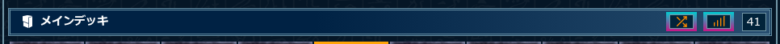
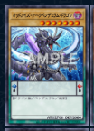
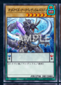
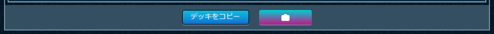
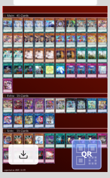
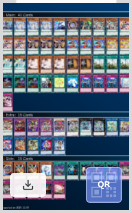
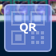
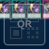

# デッキ表示ページの機能

**対象URL**: `https://www.db.yugioh-card.com/yugiohdb/member_deck.action?ope=1&...`

デッキ表示ページでは、以下の機能が利用できます。

## 機能1: カードシャッフル

デッキのカード順序をランダムに並べ替えたり、元に戻したりする機能です。特定のカードをロックして、シャッフルの影響を受けないように固定することもできます。

### ボタン

**シャッフルボタン**
- **位置**: メインデッキの枚数表示の左側
- **アイコン**: シャッフルアイコン（矢印が交差）
- **ツールチップ**: 「シャッフル」
- **機能**: ロックされていないカードをランダムに並べ替える

**ソートボタン**
- **位置**: メインデッキの枚数表示の左側（シャッフルボタンの右）
- **アイコン**: ヒストグラム昇順アイコン（棒グラフ）
- **ツールチップ**: 「元に戻す」
- **機能**: シャッフルしたカードを元の順序に戻す（ロックは解除されません）

### 使い方

#### カードをシャッフルする
1. デッキ表示ページを開く
2. 「シャッフル」ボタンをクリック
3. ロックされていないカードがランダムに並べ替わります
4. メインデッキ、エクストラデッキ、サイドデッキすべてに適用されます

#### 元の順序に戻す
1. シャッフル後、「元に戻す」ボタンをクリック
2. カードが元の順序に戻ります（ロックされたカードはそのまま）

#### カードをロックする（先頭固定）

1. カード画像の右上1/4のエリアをクリック
2. カードがロック状態になり、以下の表示になります：
   - 薄い青緑色の背景
   - 右上に南京錠アイコン（青緑線・黒グレー縁取り）

3. ロックされたカードはデッキの先頭に移動し、シャッフル時も順序が保持されます
4. もう一度右上1/4のエリアをクリックするとロックが解除されます

#### ロック機能の詳細
- ロックされたカードは常にデッキの先頭に配置されます
- シャッフル時、ロックされていないカードのみがランダムに並べ替わります
- 複数のカードをロックした場合、ロックした順序が保持されます
- ソートボタンを押してもロック状態は維持されます

## 機能2: デッキ画像作成

デッキレシピの画像を作成してダウンロードする機能です。

### ボタン

**デッキ画像作成ボタン**
- **位置**: ページ下部の `#bottom_btn_set` エリア（右端）
- **アイコン**: カメラアイコン
- **ツールチップ**: 「デッキ画像作成」
- **機能**: デッキ画像作成ダイアログを開く

### 使い方
1. デッキ表示ページを開く
2. 「デッキ画像作成」ボタン（カメラアイコン）をクリック
3. デッキ画像作成ダイアログが表示されます（詳細は後述）

## デッキ画像作成ダイアログ

デッキ画像作成ボタンをクリックすると表示されるダイアログの詳細です。

### オプション（設定項目）

**デッキ名入力欄**
- **位置**: ダイアログ上部
- **機能**: デッキ名を編集できます
- **デフォルト値**: 現在のデッキ名
- **使い方**: 入力欄をクリックして、任意のデッキ名に変更できます

**背景色の選択**
- **位置**: ダイアログ中央（プレビュー画像）
- **機能**: 画像の背景色を選択できます
- **選択肢**: 赤 ↔ 青
- **使い方**: ダイアログ全体（プレビュー画像部分）をクリックすると背景色が切り替わります

| 赤背景 | 青背景 |
|--------|--------|
|  |  |

**プレビュー画像**
- **位置**: ダイアログ中央
- **機能**: 設定した内容で作成される画像のプレビューを表示
- **表示内容**: デッキ名、背景色、QRコードの有無が反映されます

### ボタン

**QRトグルボタン**
- **位置**: ダイアログ右下
- **アイコン**: QRコードアイコン + 「QR」テキスト
- **機能**: QRコードの表示/非表示を切り替え
- **状態**:
  - **ON（青色）**: QRコードを画像に含める（デフォルト）
  - **OFF（グレー）**: QRコードを画像に含めない
- **使い方**: QRボタンをクリックして切り替え。ON/OFFの状態がボタンの色で視覚的に確認できます

| QR ON | QR OFF |
|-------|--------|
|  |  |

**ダウンロードボタン**

- **位置**: ダイアログ左下
- **アイコン**: ダウンロードアイコン
- **機能**: 設定した内容で画像を生成してダウンロード
- **使い方**:
  1. デッキ名、背景色、QRコード表示を設定
  2. ダウンロードボタンをクリック
  3. ボタンがスピナーアイコンに変わり、画像生成が開始されます
  4. 画像が自動的にダウンロードされます
  5. ダイアログが自動的に閉じます

**ダイアログを閉じる**
- **方法**: ダイアログの外側（背景のオーバーレイ）をクリック
- **機能**: 画像をダウンロードせずにダイアログを閉じます

## 操作フロー例

### 例1: デッキ画像を作成してダウンロード

1. デッキ表示ページを開く
2. 「デッキ画像作成」ボタン（カメラアイコン）をクリック
3. デッキ名を編集（必要に応じて）
4. ダイアログ全体をクリックして背景色を選択（赤または青）
5. QRボタンをクリックしてQRコードのON/OFFを選択
6. ダウンロードボタンをクリック
7. 画像がダウンロードされ、ダイアログが閉じます

### 例2: デッキをシャッフル

1. デッキ表示ページを開く
2. 「シャッフル」ボタンをクリック
3. カードの順序がランダムに並べ替わります
4. 元に戻したい場合は「元に戻す」ボタンをクリック

## 注意事項

- **対象ページ**: この機能は遊戯王カードデータベースのデッキ表示ページ（`ope=1`）でのみ動作します
- **ログイン**: デッキ機能を利用するには、遊戯王カードデータベースにログインしている必要があります
- **画像生成**: ダウンロードボタンをクリックすると、画像生成が開始されます。完了するまでしばらくお待ちください（ボタンがスピナーアイコンに変わります）

## トラブルシューティング

### ボタンが表示されない

- ページが完全に読み込まれるまで待ってください
- ページをリロードしてみてください
- 拡張機能が有効になっているか確認してください（chrome://extensions/）

### ダウンロードが開始されない

- ブラウザのダウンロード設定を確認してください
- ポップアップブロッカーが有効になっていないか確認してください
